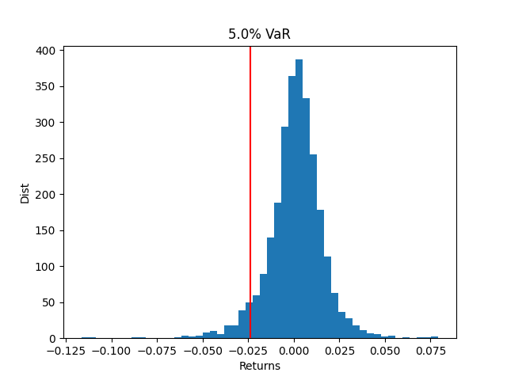

# Python Library for Quantitative Finance

---

## Objective
The purpose of this project is to build a python library for various quantitative 
finance applications such as downloading data, options pricing,
portfolio optimisation and risk management.

---

## Contents
This repository consists of four main parts:
- **/datautils:** utilities to download and store stock and crypto data
- **/notebooks:** random quantitative finance notebooks
- **/options:** library to price and visualise options
- **/portfolio:** library for portfolio optimisation

---

## Data Utils
Methods in the **data_utils** package will download and store data in a sqlite database

---

## Options Examples
The options class provides the following functionalities:
### Plotting implied volatility from live data

### Plotting implied volatility term structure analysis

### Implied volatility surface

### Greeks Analysis

---

## Portfolio Examples
The portfolio class provides the following functionalities:
### Portfolio returns correlation analysis
 
### Mean-variance optimal portfolio analysis

### Value-at-Risk 
