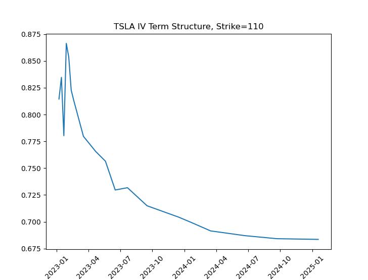
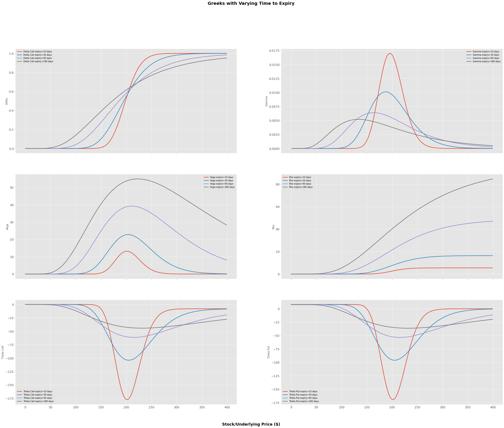
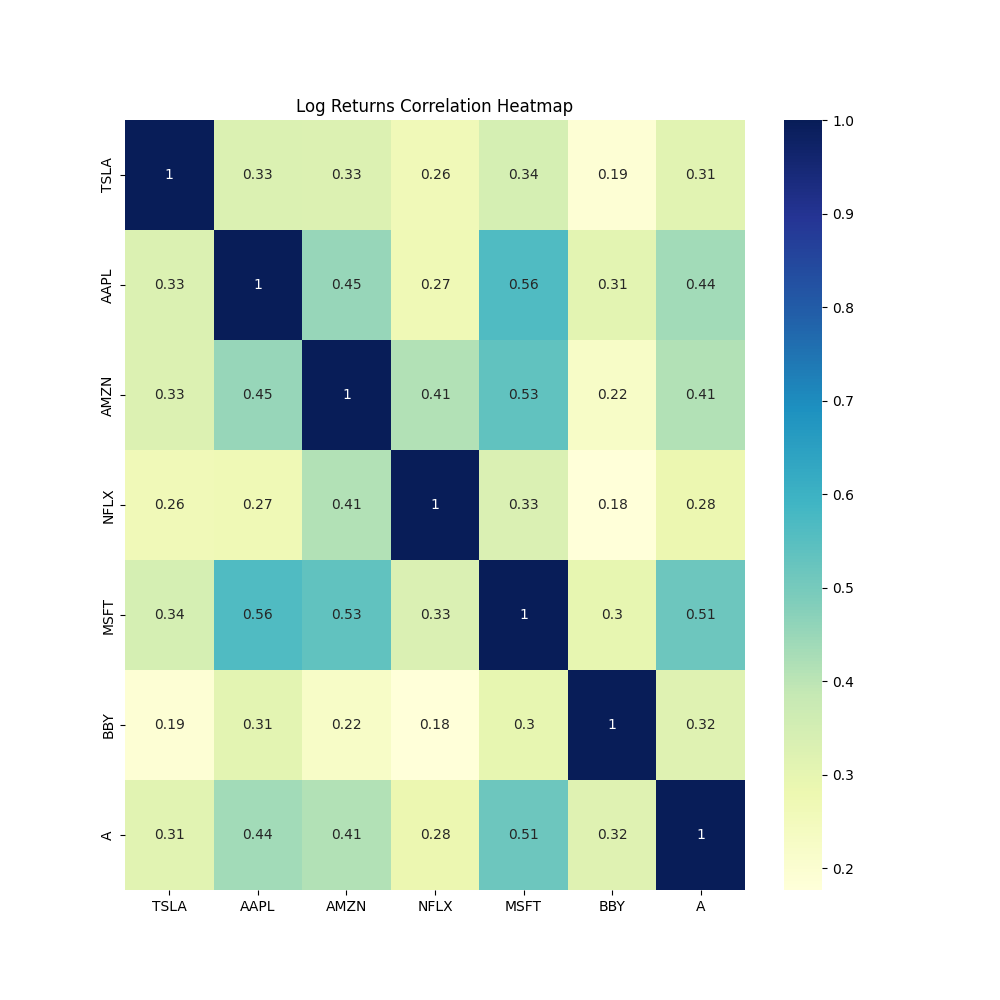
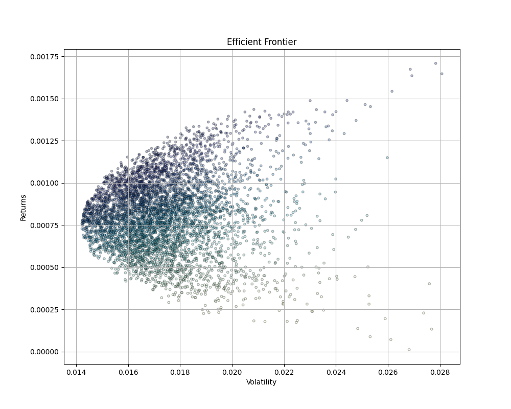

# Options Class

### Black Scholes Formulas
|                   | Formula                                                                                                                                |
|-------------------|----------------------------------------------------------------------------------------------------------------------------------------|
| Black Scholes PDE | $ \frac{\partial C}{\partial t} + \frac{1}{2}\sigma^2S^2\frac{\partial^2 C}{\partial S^2} + rS\frac{\partial C}{\partial S} - rC = 0 $ |
| Call Price        | $$ C = S N\left(d_1\right) - K e^{-rT} N\left(d_2\right)$$                                                                             |
| Put Price         | $$ P = K e^{-rT} N\left(-d_2\right) - S N\left(-d_1\right) $$                                                                          |
| d1                | $$ d_1 = \frac{\ln\left(\frac{S}{K}\right) + \left(r + {\sigma}^2/2\right)(T-t)}{\sigma\sqrt{T-t}}$$                                   |
| d2                | $$ d_2 = d_1 - \sigma \ qrt{T-t} $$                                                                                                |
| Delta Call        | $$\Delta_c = \frac{\partial C}{\partial S} = N\left(d_1\right)$$                                                                       |
| Delta Put         | Text                                                                                                                                   |
| Gamma             | Text                                                                                                                                   |
| Vega              | Text                                                                                                                                   |
| Theta Call        | Text                                                                                                                                   |
| Theta Put         | Text                                                                                                                                   |

# Figures

## Implied Volatility
|  |  |
|:---------------------------:|:----------------------------------------------:|

 

## Greeks Analysis

### Greeks

- Delta

$$
\Delta_c = \frac{\partial C}{\partial S} = N\left(d_1\right)
$$

$$
\Delta_p = \frac{\partial P}{\partial S} = 1 -N\left(d_1\right)
$$

|  |  |
|:------------------------------:|:-----------------------------:|

- Gamma

$$
\Gamma = \frac{\partial^2 C}{\partial S^2} = \frac{N'\left(d_1\right)}{S_0\sigma\sqrt{T}}
$$

- Vega

$$
\nu = \frac{\partial C}{\partial \sigma}= S\sqrt{T} N'\left(d_1\right)
$$

- Theta

$$
\Theta_c = \frac{\partial C}{\partial T} = -\frac{S N'\left(d_1\right)\sigma}{2\sqrt{T}} - rK e^{-rT} N\left(-d_2\right)
$$

$$
\Theta_p = \frac{\partial P}{\partial T} = -\frac{S N'\left(d_1\right)\sigma}{2\sqrt{T}} + rK e^{-rT} N\left(d_2\right)
$$

|  |  |
|:------------------------------:|:-----------------------------:|

- Rho

$$
\rho_c = \frac{\partial C}{\partial r} = KTe^{-rT} N\left(d_2\right)
$$

$$
\rho_p = \frac{\partial P}{\partial r} = -KTe^{-rT} N\left(-d_2\right)
$$

|  |  |
|:----------------------------:|:---------------------------:|

# Portfolio Class

|   |  |
|:----------------------------:|:-------------------------------------------:|
